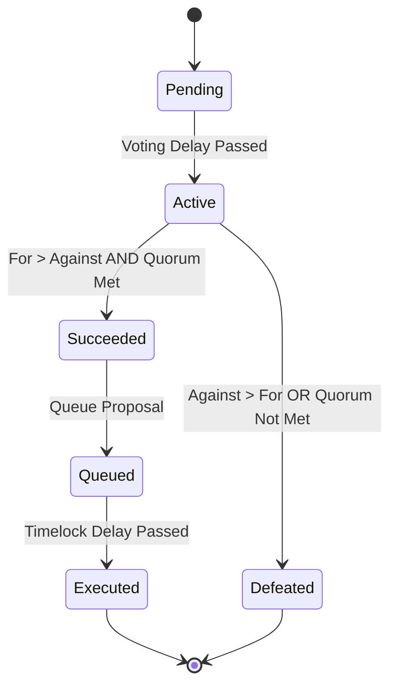

# Decentralized On-Chain Governance Platform

A robust, industrial-level decentralized governance platform built with Next.js, Hardhat, and OpenZeppelin. Features dual voting mechanisms (Standard & Quadratic), proposal lifecycle management, and vote delegation.

## Features

- **Governance Token**: ERC-20 token with voting power, delegation, and snapshot capabilities.
- **Dual Voting Mechanisms**:
  - **Standard (1T1V)**: 1 Token = 1 Vote.
  - **Quadratic Voting**: Cost = (Votes)². Promotes equitable decision-making.
- **Proposal Lifecycle**: Full management from creation -> active -> executed/defeated.
- **Interactive Dashboard**: Real-time proposal tracking, voting charts, and wallet integration.
- **Dockerized**: 1-click deployment using Docker Compose.

## Architecture

```mermaid
graph TD
    User[User / Wallet] --> |Connects| Frontend[Next.js DApp]
    Frontend --> |Reads/Writes| SmartContracts[On-Chain Governance]
    
    subgraph "Smart Contracts"
        GovToken[GovernanceToken (ERC20Votes)]
        Governor[MyGovernor]
        TimeLock[TimeLock Controller]
        
        Governor --> |Uses| GovToken
        Governor --> |Controls| TimeLock
    end
    
    subgraph "Docker Environment"
        FrontendContainer[Frontend Container]
        HardhatNode[Hardhat Node Container]
        
        FrontendContainer --> HardhatNode
    end
```

### System Overview

```mermaid
graph TD
    User[User] -->|Connects Wallet| Frontend[Next.js Frontend]
    Frontend -->|Reads/Writes| SmartContracts[Smart Contracts]
    Frontend -->|Reads| Subgraph[The Graph / Events]
    
    subgraph "Smart Contracts (Hardhat Network)"
        GovToken[GovernanceToken (ERC20Votes)]
        Governor[MyGovernor (OpenZeppelin)]
        TimeLock[TimeLock Controller]
        
        Governor -->|Controls| TimeLock
        GovToken -->|Voting Power| Governor
    end

    subgraph "Frontend Layer"
        Next[Next.js App]
        Wagmi[Wagmi/Viem Hooks]
        Rainbow[Wallet Connection]
    end
```

### Proposal Lifecycle

```mermaid
sequenceDiagram
    participant User
    participant Token as GovernanceToken
    participant Gov as MyGovernor
    
    User->>Token: Delegate Voting Power (Self)
    User->>Gov: Propose(Targets, Values, Calldatas, Description)
    Note over Gov: Voting Delay (1 Block)
    
    User->>Gov: CastVote(ProposalId, Support)
    Note over Gov: Voting Period (1 Week)
    
    else Proposal Failed
        Note over Gov: Proposal Defeated
    end
```

### Component Interaction

```mermaid
graph LR
    subgraph Frontend Components
        Wallet[WalletConnect]
        Create[CreateProposal Form]
        List[ProposalList]
        Vote[Voting Interface]
    end

    subgraph Smart Contract Functions
        subgraph GovernanceToken
            Delegate[delegate()]
            GetVotes[getVotes()]
        end

        subgraph MyGovernor
            Propose[propose()]
            CastVote[castVote/castVoteQuadratic()]
            State[state()]
            Quorum[quorum()]
        end
    end

    Wallet -->|Reads Balance| GovernanceToken
    Wallet -->|Delegates| Delegate
    
    Create -->|Checks Threshold| GetVotes
    Create -->|Submits| Propose
    
    List -->|Reads| State
    List -->|Reads| Quorum
    
    Vote -->|Submits| CastVote
```

### Proposal State Machine



## Directory Structure

```
Voting-Platform/
├── contracts/              # Smart contracts
│   ├── GovernanceToken.sol # ERC20Votes token
│   └── MyGovernor.sol      # Governor logic
├── frontend/               # Next.js Application
│   ├── src/
│   │   ├── components/     # React components
│   │   ├── pages/          # Next.js pages
│   │   └── utils/          # ABIs and helpers
│   └── next.config.js      # Next.js config
├── scripts/                # Deployment scripts
│   └── deploy.ts           # Deploy to hardhat/sepolia
├── test/                   # Hardhat tests
├── docker-compose.yml      # Container orchestration
├── Dockerfile.frontend     # Frontend container
├── Dockerfile.hardhat      # Hardhat node container
└── hardhat.config.ts       # Hardhat configuration
```

## Prerequisites

- Docker & Docker Compose
- Node.js v18+ (for local development)
- MetaMask Wallet

## Quick Start (Docker)

The easiest way to run the entire system is with Docker.

1. **Clone the repository**
   ```bash
   git clone <repository-url>
   cd Voting-Platform
   ```

2. **Start Services**
   ```bash
   docker-compose up --build
   ```
   This will:
   - Start a local Hardhat blockchain node.
   - Deploy smart contracts automatically.
   - Start the Next.js frontend.

3. **Access the DApp**
   Open [http://localhost:3000](http://localhost:3000) in your browser.

4. **Connect Wallet**
   - Connect MetaMask to **Localhost 8545**.
   - Chain ID: `31337`
   - RPC URL: `http://localhost:8545`
   - Import a test account using the private key from Hardhat node logs (or `npx hardhat node` output).

## Local Development

### Smart Contracts

1. **Install Dependencies**
   ```bash
   npm install
   ```

2. **Compile Contracts**
   ```bash
   npx hardhat compile
   ```

3. **Run Tests**
   ```bash
   npx hardhat test
   ```

4. **Deploy to Localhost**
   ```bash
   npx hardhat node
   # In a new terminal
   npx hardhat run scripts/deploy.js --network localhost
   ```

### Frontend

1. **Navigate to frontend**
   ```bash
   cd frontend
   npm install
   ```

2. **Start Dev Server**
   ```bash
   npm run dev
   ```

## Configuration

Create a `.env` file in the root directory (copy from `.env.example`):

```env
PRIVATE_KEY=your_private_key
SEPOLIA_RPC_URL=your_sepolia_url
ETHERSCAN_API_KEY=your_etherscan_key
```

